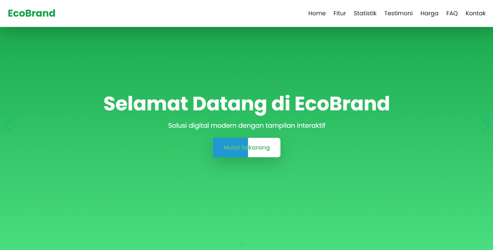

# Landing Page EcoBrand

Selamat datang di repositori **Landing Page EcoBrand**! 🚀


## 📌 Deskripsi

EcoBrand adalah landing page modern yang interaktif, responsif, dan dirancang untuk memberikan pengalaman pengguna terbaik. Dengan desain elegan, performa optimal, serta teknologi canggih, EcoBrand sangat cocok digunakan oleh bisnis, startup, maupun proyek personal yang ingin tampil profesional di dunia digital.

Saya mengembangkan proyek ini dengan visi untuk memberikan solusi gratis dan terbuka bagi siapa saja yang ingin memiliki website dengan tampilan menarik dan fitur canggih. Anda bebas menggunakan, memodifikasi, serta mendistribusikan proyek ini tanpa batasan. 🎉

## 🔥 Fitur Utama

- 🌟 **Desain Modern & Elegan** - Dibangun dengan UI/UX yang menarik dan user-friendly.
- ⚡ **Performa Tinggi** - Optimasi kecepatan loading dan efisiensi pemrosesan untuk pengalaman yang lebih baik.
- 🔒 **Keamanan Maksimal** - Menggunakan enkripsi terbaru dan standar keamanan tinggi untuk menjaga data pengguna tetap aman.
- 📊 **Analitik Data Interaktif** - Visualisasi data dengan **Chart.js** untuk memahami performa website secara lebih mendalam.
- 🎭 **Efek Animasi Menarik** - Dilengkapi dengan **GSAP**, **Anime.js**, **AOS.js**, dan **ScrollReveal** untuk membuat tampilan lebih dinamis.
- 📱 **Responsif & Mobile-Friendly** - Dibangun dengan Tailwind CSS dan Bootstrap untuk kompatibilitas di semua perangkat.
- 💬 **Testimoni Dinamis** - Menggunakan **Swiper.js** untuk menampilkan ulasan pelanggan dengan tampilan yang profesional.
- 🌍 **SEO Optimized** - Struktur kode telah dioptimalkan agar lebih mudah ditemukan di mesin pencari seperti Google.
- 🎨 **Mudah Dikustomisasi** - Kode yang bersih dan modular memudahkan pengembang untuk melakukan modifikasi sesuai kebutuhan.

## 🛠️ Teknologi yang Digunakan

- **Frontend**: HTML5, CSS3, JavaScript (Vanilla JS)
- **Framework CSS**: Tailwind CSS, Bootstrap
- **Animasi**: GSAP, Anime.js, ScrollReveal, AOS.js
- **Grafik Data**: Chart.js
- **Interaksi UI**: Swiper.js, Hover.css
- **Icon & Font**: FontAwesome, Google Fonts (Poppins)

## 📂 Struktur Direktori

```
📂 project-folder
├── 📄 index.html    # Halaman utama
├── 📂 assets        # Folder untuk gambar & ikon
│   ├── landing-preview.png  # Gambar preview landing page
├── 📄 style.css     # File styling utama
├── 📄 script.js     # File JavaScript utama
├── 📄 README.md     # Dokumentasi proyek
└── 📂 libs          # Folder untuk library eksternal
```

## 🚀 Cara Menjalankan Proyek

1. **Clone repositori ini**
   ```sh
   git clone https://github.com/username/repository-name.git
   ```
2. **Buka file `index.html` di browser**
   ```sh
   cd project-folder
   open index.html
   ```
3. **Atau gunakan live server untuk tampilan real-time**
   ```sh
   npm install -g live-server
   live-server
   ```

## 📷 Preview Tampilan



## 🛠️ Kontribusi

Saya sangat terbuka untuk kontribusi guna meningkatkan proyek ini! Jika ingin berkontribusi:

1. **Fork repositori ini**
2. **Buat branch baru (`feature-nama-fitur`)**
3. **Lakukan perubahan & commit**
4. **Push ke branch Anda**
5. **Buat Pull Request**

## 📞 Kontak

Jika ada pertanyaan, saran, atau ingin berdiskusi lebih lanjut mengenai proyek ini, silakan hubungi saya melalui:

📸 **Instagram**: [@fikriianwarr](https://www.instagram.com/fikriianwarr)

## 📜 Lisensi

Proyek ini dilisensikan di bawah **Lisensi MIT**, yang berarti **siapa saja boleh menggunakan, mengedit, mendistribusikan, dan mengembangkan proyek ini tanpa batasan**.

Tidak ada kewajiban atribusi, tetapi jika Anda ingin memberikan kredit atau berbagi pengalaman dalam menggunakan proyek ini, saya akan sangat menghargainya! 😊

